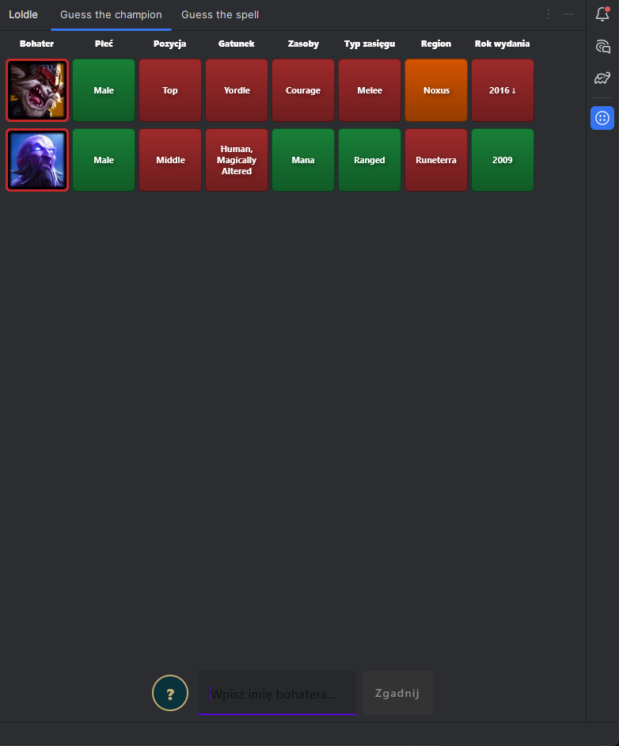
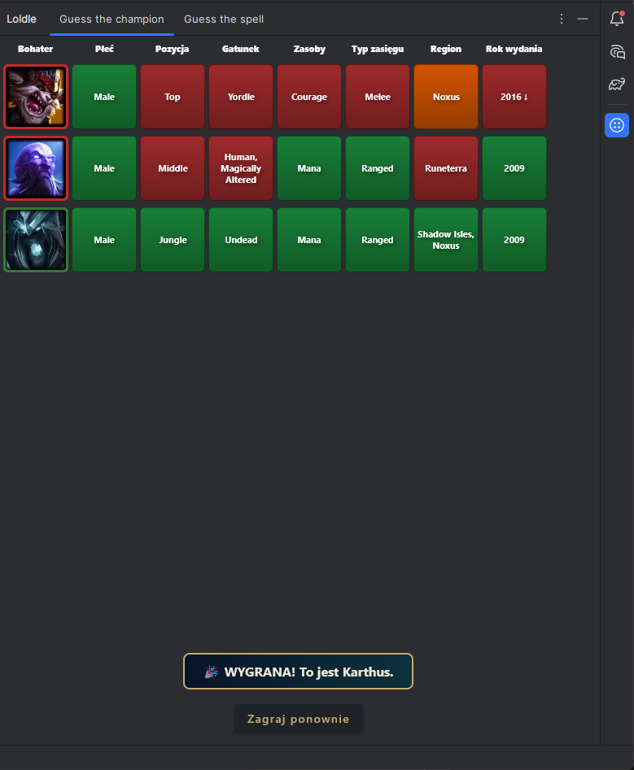
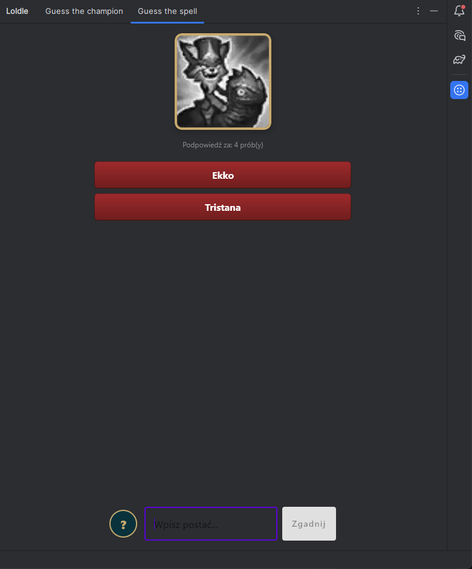
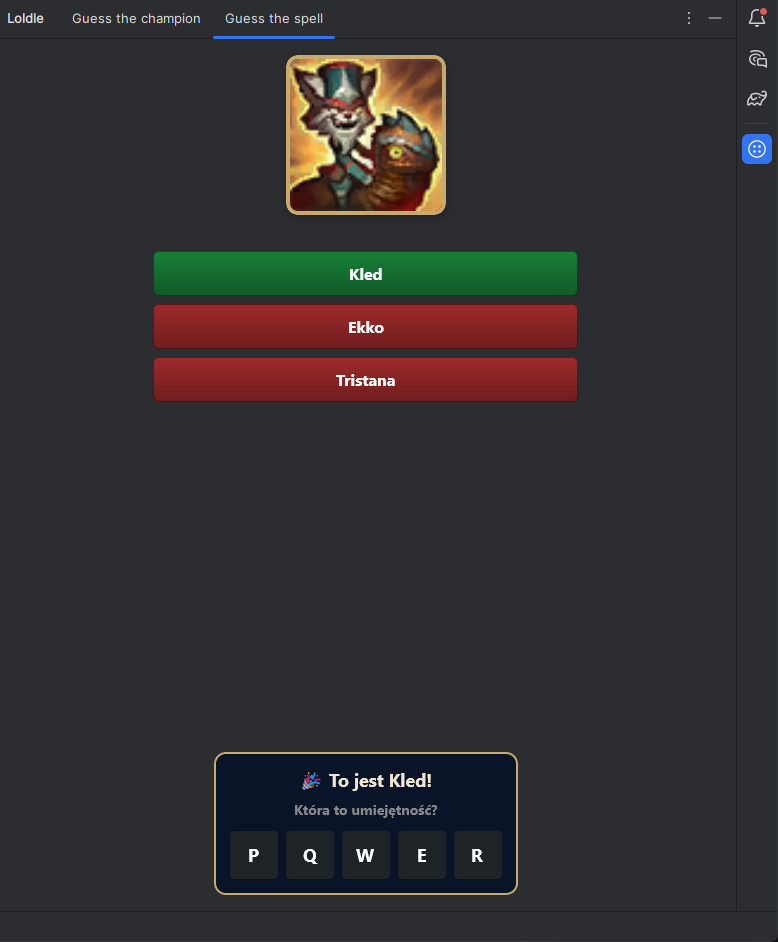
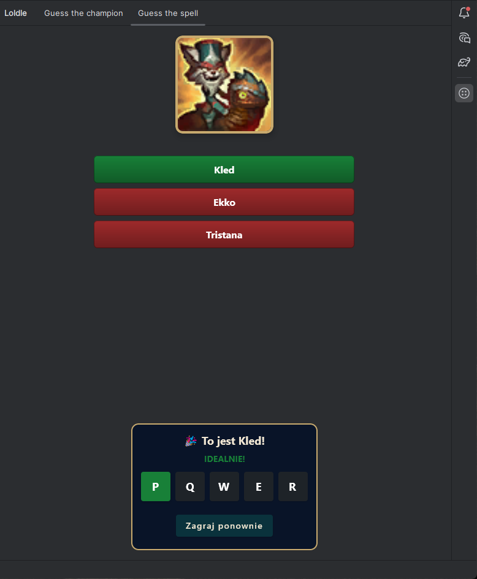

# Loldle_Plugin

LoLdle to popularna gra przeglądarkowa inspirowana mechaniką Wordle, stworzona z myślą o społeczności fanów League of
Legends. Jej głównym celem jest odgadywanie imion bohaterów gry na podstawie różnych wskazówek.

## Tryb zgadywania bohatera

W tym trybie gracze otrzymują wskazówki dotyczące cech, umiejętności, roli lub innych charakterystycznych elementów
bohatera. Na podstawie tych wskazówek muszą odgadnąć, o którego bohatera chodzi.

### ZASADY GRY

1. Wpisz nazwę bohatera z League of Legends.
2. Zielony: Dokładne trafienie.
3. Pomarańczowy: Częściowe trafienie (np. 1 z 2 ról).
4. Czerwony: Pudło.
5. Strzałki: Rok wydania bohatera jest starszy (↓) lub nowszy (↑).

Rysunek 1. Trwająca gra zgadywania bohatera.

Rysunek 2. Zwycięstwo w trybie zgadywania bohatera.

## Tryb zgadywania umiejętności bohatera

W tym trybie gracze otrzymują zdjęcie umiejętności bohatera, a ich zadaniem jest odgadnięcie, do którego bohatera należy
ta umiejętność.

### ZASADY GRY

1. Zgadnij, czyja to umiejętność.
2. Szary obrazek zyska kolory po 3 błędach.
3. Po 6 błędach poznasz linię postaci.
4. Po wygranej odgadnij przypisany klawisz!

Rysunek 3. Trwająca gra zgadywania umiejętności bohatera.

Rysunek 4. Zwycięstwo w trybie zgadywania umiejętności bohatera.

Rysunek 5. Odgadnięcie numeru umiejętności bohatera.